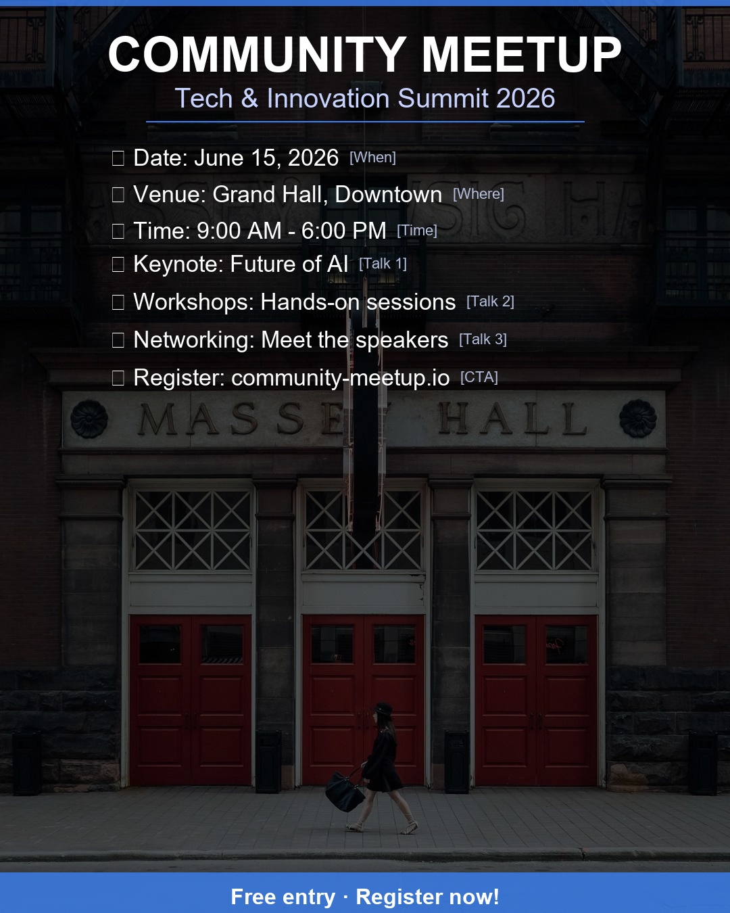
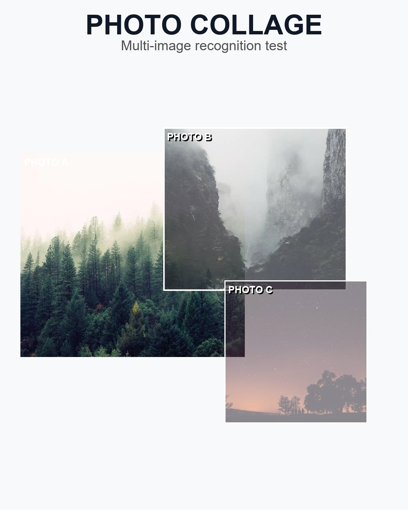
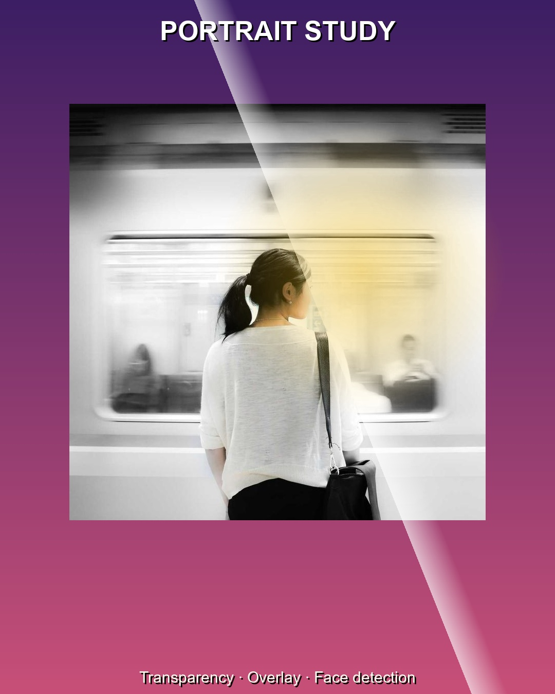
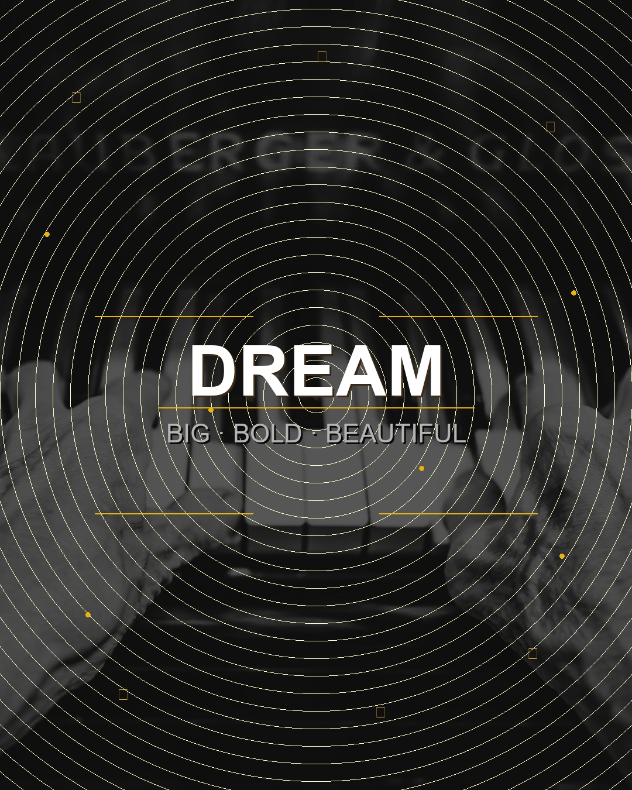
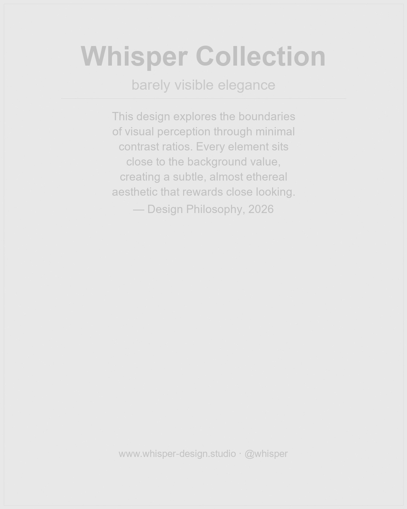
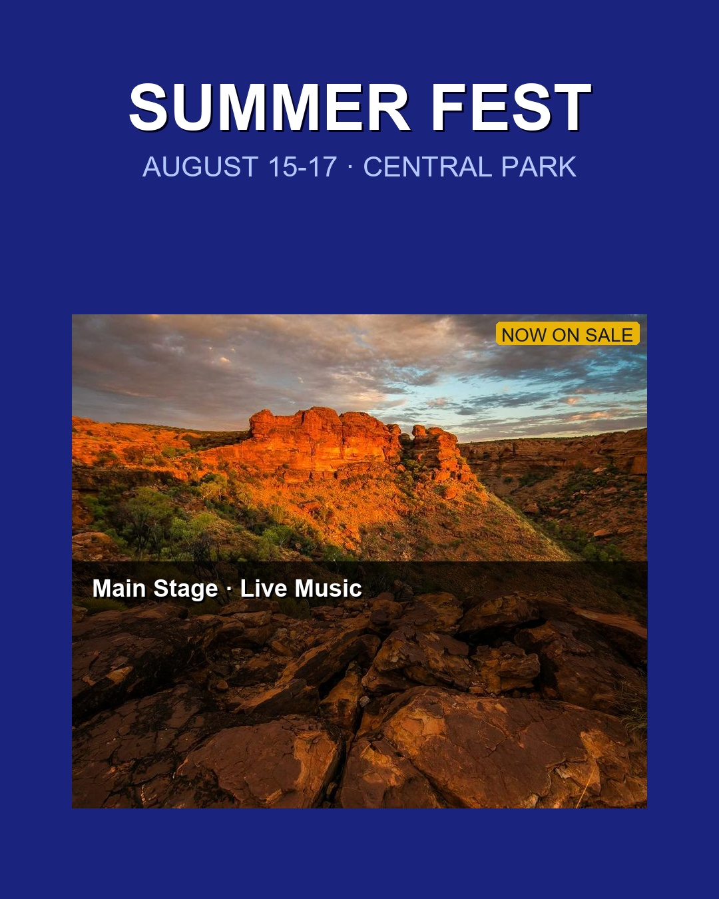
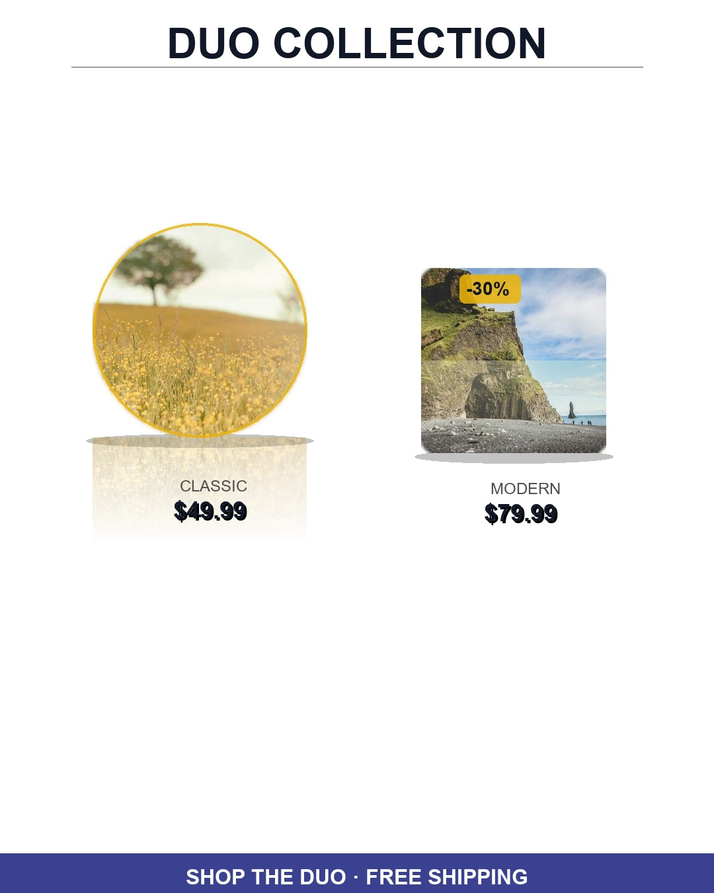

# Visual Review V2 — 3-Format Comparison (3-Prompt System + Normalized Coords)

V2 usa **3 prompts secuenciales** (composición → texto → imágenes/formas) con
**coordenadas normalizadas 0..1** y schema aplanado con categorías cerradas.

Modelo: `google/gemini-2.5-flash` para las 11 imágenes.

| Imagen | Original | SceneGraph V2 (assembly) | SVG V2 | HTML V2 |
|--------|----------|--------------------------|--------|---------|
| banner-horizontal |  | [assembly.json](output/google-gemini-2-5-flash/scenegraph-v2/banner-horizontal/assembly.json) |  |  |
| flyer-text-heavy |  | [assembly.json](output/google-gemini-2-5-flash/scenegraph-v2/flyer-text-heavy/assembly.json) |  |  |
| meditacion_11_julio_vertical_completo |  | [assembly.json](output/google-gemini-2-5-flash/scenegraph-v2/meditacion_11_julio_vertical_completo/assembly.json) |  |  |
| multi-photo-collage |  | [assembly.json](output/google-gemini-2-5-flash/scenegraph-v2/multi-photo-collage/assembly.json) |  |  |
| portrait-overlay |  | [assembly.json](output/google-gemini-2-5-flash/scenegraph-v2/portrait-overlay/assembly.json) |  |  |
| poster-display-font |  | [assembly.json](output/google-gemini-2-5-flash/scenegraph-v2/poster-display-font/assembly.json) |  |  |
| poster-gradient |  | [assembly.json](output/google-gemini-2-5-flash/scenegraph-v2/poster-gradient/assembly.json) |  |  |
| poster-low-contrast |  | [assembly.json](output/google-gemini-2-5-flash/scenegraph-v2/poster-low-contrast/assembly.json) |  |  |
| poster-person |  | [assembly.json](output/google-gemini-2-5-flash/scenegraph-v2/poster-person/assembly.json) |  |  |
| poster-simple |  | [assembly.json](output/google-gemini-2-5-flash/scenegraph-v2/poster-simple/assembly.json) |  |  |
| showcase-two-products |  | [assembly.json](output/google-gemini-2-5-flash/scenegraph-v2/showcase-two-products/assembly.json) |  |  |

## Estructura de archivos V2 (por imagen)

```
output/<model>/<formato>-v2/<imagen>/
├── prompt-1-composition.json   # Composición espacial (regiones)
├── prompt-2-text.json          # Textos extraídos
├── prompt-3-shapes.json        # Imágenes y formas
├── assembly.json               # Fusión de los 3 prompts
├── output.<ext>                # Formato final (JSON / SVG / HTML)
└── render.png                  # Render (solo SVG y HTML)
```

> SceneGraph V2 no tiene render propio porque necesita compilación a .tc.
> Para ver los renders SVG y HTML, abre este archivo con Markdown Preview en VS Code.

<style>
table img { max-width: 160px; max-height: 130px; object-fit: contain; }
</style>
